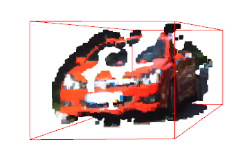
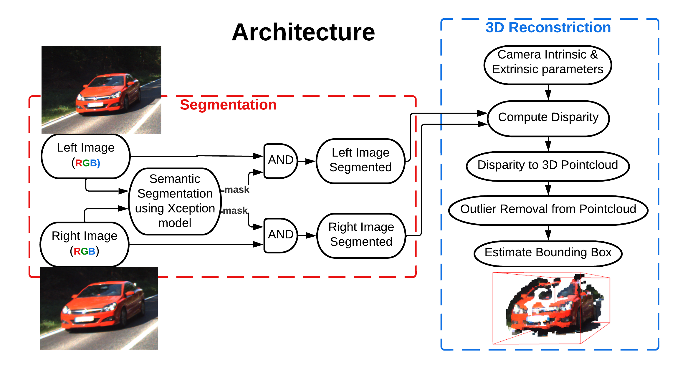
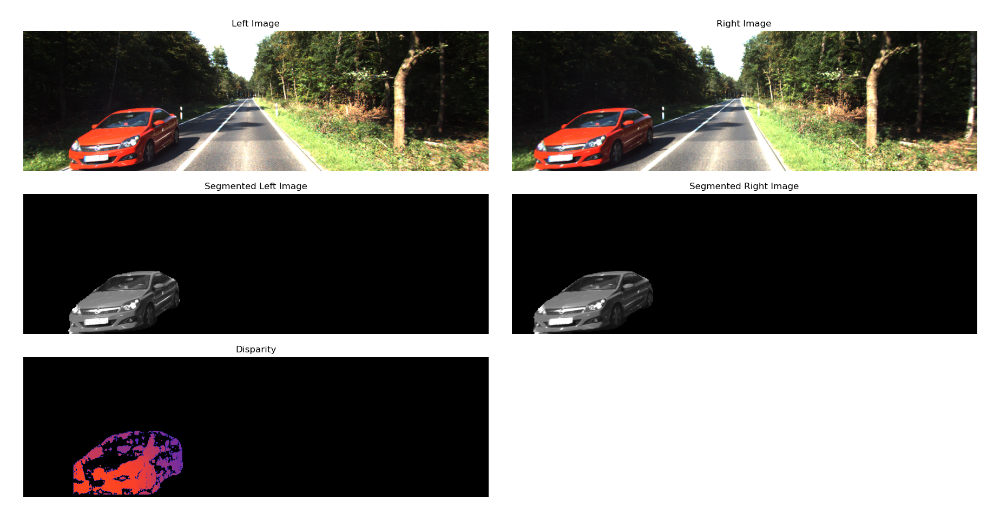
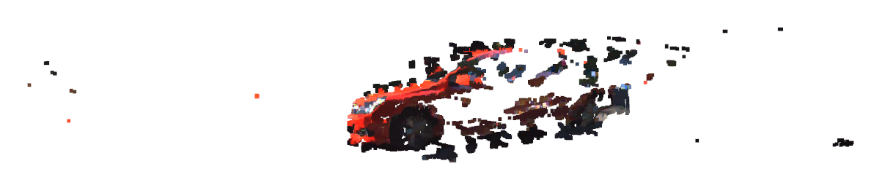
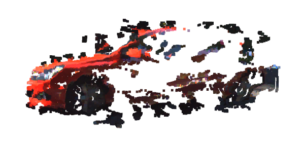
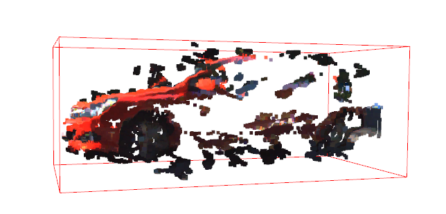
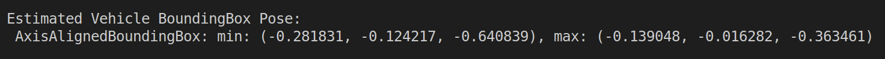

# Image segmentation, Tracking, and Reconstruction of Dynamic Objects using Stereo Camera

  

### Dependencies:
1. OpenCV
2. [PixelLib](https://pixellib.readthedocs.io/en/latest/index.html)
3. [Open3D](http://www.open3d.org/docs/release/index.html)

## Architecture

  

### 1. Semantic Segmentation outputs using Xception model from DeeplabV3 framework

  

Semantic segmentation is used to label each pixel of the image with a corresponding class. For segmenting the object from the selected scene, Xception model from DeeplabV3 framework trained on pascalvoc dataset is used. Xception is a CNN with 71 deep layers. The pre-trained model is trained on millions of images on pascal voc dataset with 20 object classes such as car, aeroplane, cat, person, house, motorbike, sheep etc with their respective colormaps.  

### 2. Disparity, Depth Estimation and 3D PointCloud Construction

  

The disparity map is estimated by StereoBM() in OpenCV using the left and right segmented grayscale images. By giving camera intrinsic and extrinsic parameters to OpenCV’s stereoRectify, the disparity-to-depth matrix is calculated (). The 3D points are obtained using reprojectImageTo3D() and finally, colors are extracted from the left image and overlaid on the PointCloud. Once the outliers in the point cloud data are filtered, we put bounding boxes over the vehicles. Using the axis aligned boundingbox function from the open3d geometry library, a the bounding box is displayed over the
PoinCloud.

### 3. Outlier Removal using Radius Method

  

To properly determine the object’s pose, the outliers in the PointCloud must be removed. Using the Open3d library’s radius outlier removal function, a minimum number of nearby points that each point must have inside a specified sphere’s radius in order to be kept in the PointCloud is used to obtain the
conditioned PointCloud.

### 4. Estimating Bounding Box & Pose

  

  

Bounding Box denotes the coordinates of the border of the cuboid enclosing the object segmented. This box can be further used to identify the pose for object detection. Using the get axis aligned bounding box function from the open3d geometry library, the bounding box is displayed over the PointCloud. The bounding box is generated using the PointCloud data with the inliers, which takes the minimum and maximum coordinates of the points which are defined as x,y,z coordinates, a 3D bounding box is generated enclosing the object.
